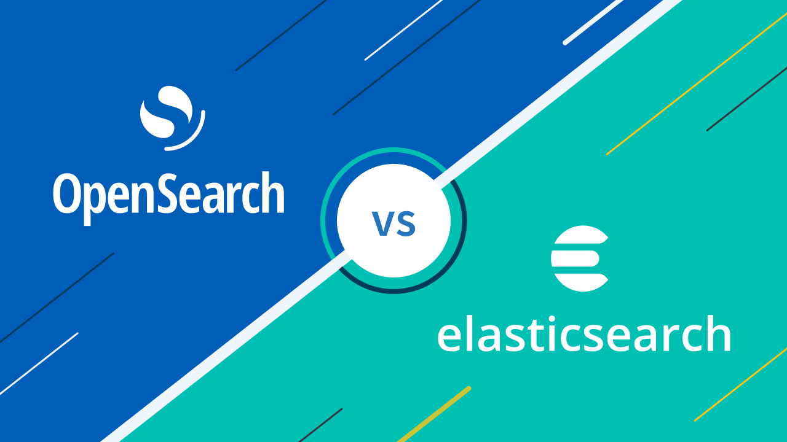

# Introdución a Elasticsearch / OpenSearch

## Que son Elasticsearch e OpenSearch

**Elasticsearch** e **OpenSearch** son motores de busca e análise distribuídos, orientados a traballar con grandes volumes de datos en tempo case real. Están deseñados para permitir consultas moi rápidas sobre datos estruturados, semiestruturados e non estruturados.

- **Elasticsearch** é un proxecto orixinalmente open source, baseado en **Apache Lucene**, desenvolvido por Elastic.
- **OpenSearch** é un fork completamente open source de Elasticsearch (versións 7.10 e anteriores), mantido pola **OpenSearch Software Foundation** baixo o paraugas de Linux Foundation.

Ambos comparten a mesma filosofía, arquitectura e practicamente a mesma API básica, polo que os conceptos fundamentais son comúns.



---

## Para que se usan

Elasticsearch / OpenSearch empréganse habitualmente en escenarios como:

- **Buscadores avanzados** (webs, catálogos, plataformas educativas…)
- **Análise de logs e eventos** (observabilidade, seguridade, SIEM)
- **Monitorización de sistemas e aplicacións**
- **Análise de datos en tempo case real**
- **Dashboards e visualizacións interactivas** (Kibana / OpenSearch Dashboards)
- **Indexación de datos procedentes de pipelines Big Data**

No contexto de **Big Data**, adoitan actuar como capa de **consulta e visualización**, complementando sistemas de almacenamento e procesamento como HDFS, S3 ou Apache Spark.

---

## Principais características

- **Distribuído por deseño**: funciona como un clúster de nodos
- **Escalabilidade horizontal**: pódense engadir nodos facilmente
- **Alta dispoñibilidade** mediante réplicas
- **Consultas moi rápidas** grazas á indexación invertida
- **Inxestión en tempo real** de datos
- **API REST** baseada en HTTP e JSON
- **Integración sinxela** con múltiples linguaxes e ferramentas

---

## Conceptos fundamentais

### Clúster e nodos
- **Clúster**: conxunto de nodos que traballan conxuntamente
- **Nodo**: instancia de Elasticsearch/OpenSearch
  - master
  - data
  - ingest
  - coordinating

### Índice
Un **índice** é unha colección de documentos que comparten unha estrutura lóxica semellante. Podería compararse cunha base de datos en sistemas relacionais.

### Documento
- Unidade básica de información
- Representado en formato **JSON**
- Comparable a unha fila dunha táboa relacional

### Shards e réplicas
- **Shard**: partición dun índice
- **Replica**: copia dun shard para tolerancia a fallos e mellor rendemento

---

## Modelo de datos

Elasticsearch/OpenSearch non usa esquemas ríxidos como as bases de datos relacionais.

- Cada documento é un JSON
- Os campos teñen tipos (text, keyword, integer, date, etc.)
- O mapeo pode ser:
  - **dinámico** (créase automaticamente)
  - **explícito** (definido polo usuario)

Exemplo de documento:
```json
{
  "usuario": "admin",
  "accion": "login",
  "timestamp": "2025-03-15T10:21:00",
  "ip": "192.168.1.10"
}
```

## Busca e consultas

Un dos puntos fortes de Elasticsearch e OpenSearch é o seu potente sistema de consultas, baseado en **JSON Query DSL**, que permite realizar operacións complexas de forma flexible e eficiente.

Entre as principais capacidades destacan:

- **Full-text search**
- **Filtros**
- **Consultas booleanas**
- **Agregacións** (similar a un `GROUP BY` en SQL)
- **Ordenación e paginación**
- **Consultas xeoespaciais**

Estas funcionalidades fan que sexan ferramentas especialmente axeitadas para a análise de grandes volumes de datos en tempo case real.

---

## Visualización e análise

Para a análise visual dos datos, ambos motores dispoñen de ferramentas específicas:

- **Kibana** no caso de Elasticsearch
- **OpenSearch Dashboards** no caso de OpenSearch

Estas ferramentas permiten:

- Crear **dashboards** interactivos
- Visualizar **métricas e logs**
- Analizar datos en **tempo real**
- Compartir **informes** e paneis

---

## Elasticsearch vs OpenSearch

| Aspecto | Elasticsearch | OpenSearch |
|-------|---------------|------------|
| Licenza | Elastic License / SSPL | Apache 2.0 |
| Open source | Parcial | Si |
| Compatibilidade | Elastic Stack oficial | Alta con Elasticsearch 7.x |
| Visualización | Kibana | OpenSearch Dashboards |
| Vendor lock-in | Maior | Menor |

Na práctica docente e en contornos formativos, **OpenSearch** adoita ser unha opción máis adecuada polo seu carácter completamente *open source*.

---

## Integración en arquitecturas Big Data

Elasticsearch e OpenSearch intégranse habitualmente como capa de consulta e análise dentro de arquitecturas Big Data, combinándose con ferramentas como:

- **Kafka** (inxestión de eventos)
- **Logstash / Fluentd / Filebeat**
- **Apache Spark** (procesamento batch e streaming)
- **Apache NiFi**
- **Bases de datos SQL e NoSQL**

Un exemplo típico de arquitectura sería:

```
Fonte de datos → Kafka → Spark / Logstash → OpenSearch → Dashboards
```

## Cando usalos (e cando non)

Elasticsearch e OpenSearch son ferramentas moi potentes, pero non son axeitadas para todos os escenarios. É importante coñecer ben cando achegan valor e cando convén empregar outras solucións.

### Usalos cando:

- Necesitas **buscas rápidas e flexibles** sobre grandes volumes de datos
- Traballas con **eventos, logs ou métricas**, especialmente en contornos distribuídos
- Precisas **análise case en tempo real** da información
- Queres crear **dashboards interactivos** para exploración e visualización de datos
- A prioridade é a consulta e análise, non a xestión transaccional

### Evitalos cando:

- Precisas **transaccións ACID complexas** ou forte consistencia
- Os datos son **altamente relacionais** e requiren *joins* frecuentes
- A prioridade principal é o **almacenamento a longo prazo** máis que a consulta
- Necesitas un sistema como fonte de verdade (*system of record*)

## Resumo
Elasticsearch e OpenSearch son ferramentas clave no ecosistema Big Data para a busca, análise e visualización de datos. Non substitúen a un data lake nin a un data warehouse, pero complétanos proporcionando acceso rápido e interactivo á información.

No ámbito educativo e open source, **OpenSearch** é unha alternativa especialmente interesante para traballar estes conceptos sen restricións de licenza.

## Bibliografía e recursos

### Documentación oficial

- **OpenSearch Documentation**  
  https://opensearch.org/docs/  
  Documentación oficial do proxecto OpenSearch, con explicacións detalladas sobre arquitectura, indexación, consultas, seguridade e OpenSearch Dashboards.

- **Elasticsearch Reference**  
  https://www.elastic.co/guide/index.html  
  Guía de referencia de Elasticsearch, útil para comprender o funcionamento interno, a Query DSL e os conceptos fundamentais do motor de busca.

- **Apache Lucene Documentation**  
  https://lucene.apache.org/core/  
  Documentación do motor de indexación no que se basean Elasticsearch e OpenSearch, recomendable para afondar en conceptos de busca full-text.

---

### Libros

- **Gormley, C., Tong, Z.** *Elasticsearch: The Definitive Guide*. O’Reilly Media.  
  Libro clásico (dispoñible en liña) que explica en profundidade o modelo de datos, as consultas e a arquitectura distribuída.

- **Banoulas, D.** *Learning Elasticsearch*. Packt Publishing.  
  Introdución práctica orientada ao uso real do motor en proxectos de análise e busca.

---

### Artigos e recursos técnicos

- **Elastic – Query DSL**  
  https://www.elastic.co/guide/en/elasticsearch/reference/current/query-dsl.html  
  Descrición detallada da linguaxe de consultas baseada en JSON.

- **OpenSearch Dashboards Documentation**  
  https://opensearch.org/docs/latest/dashboards/  
  Guía para a creación de visualizacións, paneis e análises interactivas con OpenSearch.

- **Elastic Stack Overview**  
  https://www.elastic.co/elastic-stack/  
  Visión xeral do ecosistema Elastic Stack (Elasticsearch, Logstash, Beats e Kibana).

---

### Integración en Big Data

- **Elasticsearch for Apache Spark**  
  https://www.elastic.co/guide/en/elasticsearch/hadoop/current/index.html  
  Documentación do conector oficial para integrar Elasticsearch con Apache Spark.

- **Kafka Connect Elasticsearch / OpenSearch**  
  https://docs.confluent.io/platform/current/connect/connect-elasticsearch.html  
  Referencia para a integración de Kafka con motores de busca e análise.

---

### Recursos formativos

- **OpenSearch Tutorials**  
  https://opensearch.org/docs/latest/tutorials/  
  Titoriais oficiais con exemplos prácticos e casos de uso.

- **Elastic Training (free resources)**  
  https://www.elastic.co/training/free  
  Materiais formativos gratuítos sobre Elasticsearch e Kibana.

