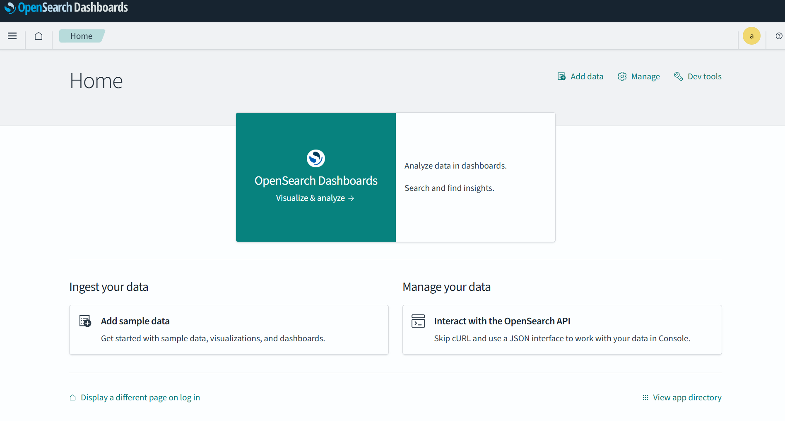
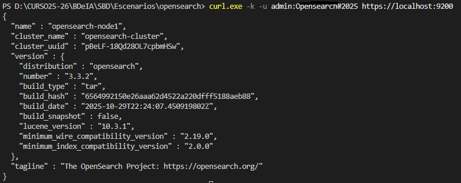

# Instalación de OpenSearch mediante Docker

Nesta sección descríbese a instalación dun contorno básico de **OpenSearch** empregando **Docker**, unha opción especialmente axeitada para contornos educativos, probas e laboratorios, xa que permite despregar o sistema de forma rápida e reproducible.

---

## Requisitos previos

Antes de comezar, é necesario dispoñer de:

- Docker instalado (versión recente)
- Docker Compose (plugin ou ferramenta independente)
- Polo menos **4 GB de memoria RAM** dispoñible (recomendado)

---

## Despregue básico con Docker Compose

O seguinte ficheiro `docker-compose.yml` permite despregar:

- OpenSearch (1 nodo)
- OpenSearch Dashboards

### Estrutura do contorno

opensearch/
├── docker-compose.yml

```yaml
services:
  opensearch:
    image: opensearchproject/opensearch:2
    container_name: opensearch
    environment:
      - cluster.name=opensearch-cluster
      - node.name=opensearch-node
      - discovery.type=single-node
      - bootstrap.memory_lock=true
      - OPENSEARCH_JAVA_OPTS=-Xms1g -Xmx1g
      - OPENSEARCH_INITIAL_ADMIN_PASSWORD=${OPENSEARCH_INITIAL_ADMIN_PASSWORD}
    ulimits:
      memlock:
        soft: -1
        hard: -1
    volumes:
      - opensearch-data:/usr/share/opensearch/data
    ports:
      - "9200:9200"
      - "9600:9600"
    networks:
      - opensearch-net

  opensearch-dashboards:
    image: opensearchproject/opensearch-dashboards:2
    container_name: opensearch-dashboards
    ports:
      - "5601:5601"
    environment:
      - OPENSEARCH_HOSTS=["https://opensearch:9200"]
    depends_on:
      - opensearch
    networks:
      - opensearch-net

volumes:
  opensearch-data:

networks:
  opensearch-net:

```

### Configuración do contrasinal de admin
Con esta configuración é necesario especificar o contrasinal de administrador. Para eso creamos un ficheiro `.env` no mesmo directorio que o noso `docker-compose.yml` e nel declaramos a variable `OPENSEARCH_INITIAL_ADMIN_PASSWORD`.

```bash
OPENSEARCH_INITIAL_ADMIN_PASSWORD=<contrasinal>
```
O contrasinal debe cumplir os seguintes requisitos:
- 8 caracteres como mínimo.
- Debe conter, polo menos, unha letra maiúscula [A-Z].
- Debe conter, polo menos, unha letra minúscula [a-z].
- Debe conter, plo menos, un díxito [0-9].
- Debe conter, polo menos, un carácter especial.
- Suxestión: `Opensearch#2005`

### Posta en marcha do contorno
Unha vez temos todo listo lanzamos o clúster co seguinte comando:

```bash
docker compose up -d
```


## Verificación do funcionamento

### Interfaz gráfica
Podemos comprobar o acceso a **Opensearch Dashboards** en `http://localhost:5601` (Temos que introducir o noso contrasinal e seleccionar a opción de contorno privado).

### Liña de comandos
Executamos o seguinte comando.
- Dende windows:
```powershell
curl.exe -k -u admin:<contrasinal> https://localhost:9200
```

- Dende GNU/Linux:
```powershell
curl -k -u admin:<contrasinal> https://localhost:9200
```


## Boas prácticas
- Non subir o ficheiro `.env` a repositorios públicos.
- Engadir  `.env` ao `.gitignore`.
- Usar contrasinais distintos.

## Documentación

- **OpenSearch Documentation**  
  https://opensearch.org/docs/  
  Documentación oficial do proxecto OpenSearch, con explicacións detalladas sobre arquitectura, indexación, consultas, seguridade e OpenSearch Dashboards.

- **Download and Getting Sterted**  
  https://opensearch.org/downloads/  
  Guía de descarga e instalación de `openseach`.

- **opensearch-project**  
  https://github.com/opensearch-project/  
  Repositorio oficial de **Opensearch**.