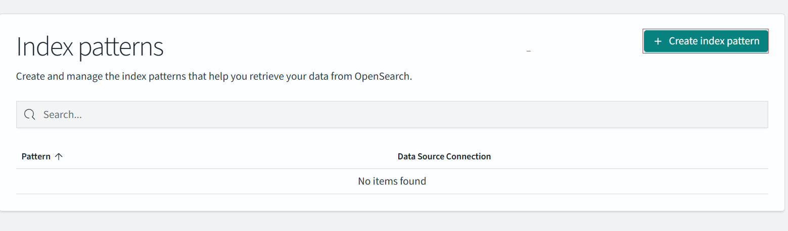
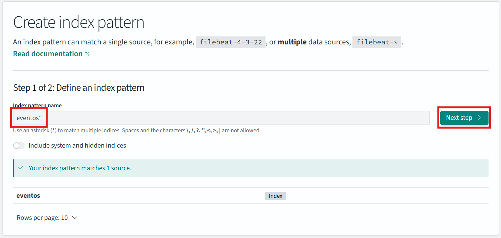
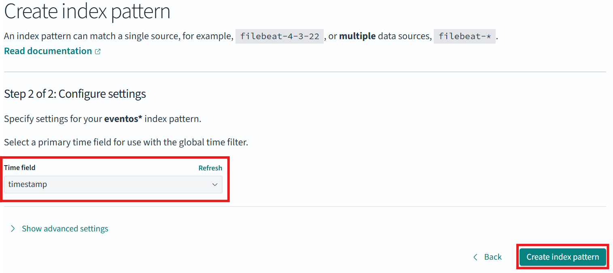
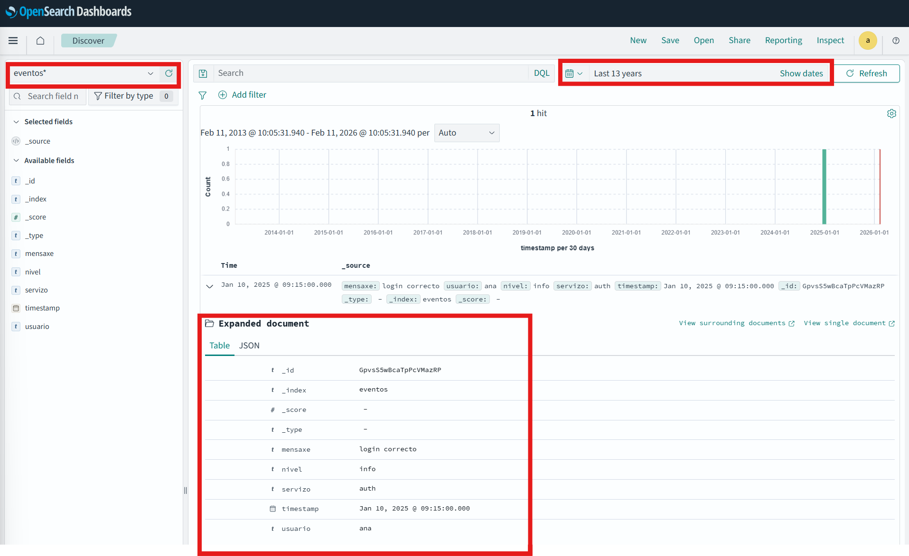

# Primeiros pasos con OpenSearch

Unha vez instalado e en execución o contorno de OpenSearch, nesta sección realízase unha primeira toma de contacto co sistema, centrada na creación de índices, inserción de documentos e realización de consultas básicas.

O obxectivo é comprender o modelo de datos e o funcionamento das buscas antes de integrar OpenSearch en arquitecturas máis complexas.

---

## Acceso ao servizo

Para traballar coa API REST de OpenSearch de forma cómoda e sen problemas de configuración, empregarase **Dev Tools (Console)**, incluído en OpenSearch Dashboards.

1. Acceder a OpenSearch Dashboards en:  
   `http://localhost:5601`
2. Ir ao menú **Dev Tools → Console**

Desde esta consola pódense executar directamente peticións REST contra OpenSearch.

---

## Creación dun índice

Un índice é a unidade lóxica principal onde se almacenan os documentos. No seguinte exemplo créase un índice sinxelo chamado `eventos`.

```http
PUT eventos
```
Se a operación é correcta, OpenSearch devolverá unha resposta de confirmación.
```json
{"acknowledged":true,"shards_acknowledged":true,"index":"eventos"}
```

## Inserción de documentos
Os datos en OpenSearch almacénanse en forma de **documentos JSON**. A continuación insírense dous documentos de exemplo no índice `eventos`.
```http
POST eventos/_doc
{
  "mensaxe": "login correcto",
  "usuario": "ana",
  "nivel": "info",
  "servizo": "auth",
  "timestamp": "2026-02-10T08:15:00"
}

```

## Consulta básica de documentos
1. Recuperar todos os documentos:
```http
GET eventos/_search
```

2. Busca full-text:
```http
GET eventos/_search
{
  "query": {
    "match": {
      "mensaxe": "login"
    }
  }
}

```

3. **Filtros por campo**
Para realizar filtros exactos sobre campos non analizados, emprégase `term`.

```http
GET eventos/_search
{
  "query": {
    "term": {
      "nivel": "warn"
    }
  }
}

```

4. **Consultas booleanas**
É posible combinar varias condicións mediante consultas booleanas:
```http
GET eventos/_search
{
  "query": {
    "bool": {
      "must": [
        { "match": { "mensaxe": "login" } }
      ],
      "filter": [
        { "term": { "servizo": "auth" } }
      ]
    }
  }
}
```

## Visualización en Opensearch Dashboards
Ademais da consola, OpenSearch Dashboards permite explorar os datos de forma visual.
1. Ir a **Discover**.
2. Crear un *Index Pattern* para o índice `eventos`.


3. Seleccionar o campo `timestamp` como campo temporal.

4. Agora podemos explorar os documentos, aplicar filtros e intervalos de tempo, etc.

## Exploración de documentos en Discover

Unha vez creado o *Data View* para o índice `eventos`, pódense explorar os documentos de forma interactiva mediante a vista **Discover** en OpenSearch Dashboards.

---

### Acceso a Discover

1. Acceder a **OpenSearch Dashboards**
2. Ir ao menú **Discover**
3. Seleccionar o *Data View* asociado ao índice `eventos`

Nesta vista móstrase a lista de documentos indexados e os seus campos.

---

### Exploración dos documentos

Na vista **Discover**, cando o *Data View* ten configurado un campo temporal, a interface móstrase dividida en dúas partes:

1. Na parte superior aparece un **histograma temporal**, que representa a distribución dos documentos ao longo do tempo segundo o filtro seleccionado.
2. Debaixo do gráfico móstrase a **lista de documentos en formato táboa**.

Se non se visualizan os documentos, débese comprobar:
- O **rango temporal** (parte superior dereita).
- Que non existan **filtros activos**.
- Que o histograma non estea ocupando toda a pantalla (pódese desprazar cara abaixo).


---

Na táboa de resultados:

- Cada fila corresponde a un **documento**
- Pódese premer sobre un documento para ver o seu contido completo
- Os campos aparecen estruturados en formato JSON
- O número total de resultados (*hits*) aparece indicado na parte superior

É posible:

- Ordenar documentos por calquera campo
- Seleccionar que campos se mostran na táboa
- Engadir ou eliminar columnas
- Ver o valor exacto de cada campo
- Filtrar directamente facendo clic sobre un valor concreto


---

### Aplicación de filtros por campo

Os filtros permiten restrinxir os documentos visibles segundo condicións concretas.

⚠️ Importante:  
Se na táboa só aparece a columna `_source`, non será posible aplicar filtros directamente sobre os valores. Primeiro hai que engadir os campos como columnas individuais.

---

### Engadir campos á táboa

1. No panel lateral esquerdo, localizar o campo (por exemplo `nivel`)
2. Premer no botón **+** situado ao lado do nome do campo
3. O campo engadirase como nova columna na táboa de resultados

Recoméndase engadir como columnas os campos máis relevantes (`nivel`, `usuario`, `servizo`, `mensaxe`, etc.) para facilitar a análise.

---

### Aplicar filtro desde a táboa

Unha vez que o campo está visible como columna:

1. Localizar na táboa un valor concreto (por exemplo `warn`)
2. Pasar o rato sobre ese valor
3. Seleccionar:
   - ➕ **Filter for value** (incluír)
   - ➖ **Filter out value** (excluír)

O filtro aplicarase automaticamente e só se mostrarán os documentos que cumpran a condición.

---

### Crear filtros manualmente

Tamén é posible crear filtros desde a barra superior:

1. Premer en **Add filter**
2. Seleccionar o campo
3. Escoller o operador (`is`, `is not`, `exists`, etc.)
4. Indicar o valor correspondente
5. Aplicar o filtro

Este método permite combinar varias condicións e realizar consultas máis complexas.


### Uso do buscador (KQL / Lucene)

Na barra de busca pódense escribir consultas sinxelas, por exemplo:

```kql
nivel: warn
```

Ou combinar condicións:
```kql
servizo: auth AND nivel: warn
```

Este método permite explorar rapidamente os datos sen escribir consultas JSON.

---

### Selección de intervalos de tempo

Se o *Data View* ten definido un campo temporal (por exemplo `timestamp`), Discover permite filtrar os datos por tempo.

1. Na esquina superior dereita, localizar o selector de tempo
2. Escoller un intervalo predefinido:
   - Last 15 minutes
   - Last 1 hour
   - Last 24 hours
3. Ou definir un intervalo personalizado

Só se mostrarán os documentos cuxo campo temporal estea dentro do intervalo seleccionado.
> No noso caso temos que cabmiar o intervalo aos últimos dous anos (por exemplo) para que aparezan os eventos.
---

### Actualización en tempo real

É posible activar a **actualización automática** para ver como aparecen novos documentos a medida que se indexan.

- Activar *Auto refresh*
- Escoller a frecuencia (por exemplo, cada 5 segundos)

Isto é especialmente útil cando se traballa con logs ou datos en tempo real.

---

### Resumo

A vista **Discover** permite:

- Explorar documentos individualmente
- Aplicar filtros por campos
- Realizar buscas sinxelas sen JSON
- Filtrar datos por intervalos de tempo
- Analizar información de forma visual e interactiva

Discover é a ferramenta principal para a análise exploratoria de datos en OpenSearch Dashboards.

## Conclusión e seguintes pasos

Neste documento realizouse unha primeira aproximación práctica a OpenSearch, cubrindo os conceptos e operacións fundamentais necesarios para comezar a traballar coa ferramenta.

Ao rematar esta sección, deberíase ser capaz de:

- Comprender o **modelo de datos** de OpenSearch (índices e documentos)
- Crear índices e inserir documentos en formato JSON
- Realizar **consultas básicas** empregando Query DSL
- Explorar os datos de forma interactiva mediante **Discover**
- Aplicar filtros, buscas e **intervalos temporais**
- Entender a importancia do tempo na análise de eventos e logs

Este primeiro contacto céntrase nun uso manual e controlado de OpenSearch, pensado para comprender os conceptos clave antes de avanzar cara a escenarios máis realistas.

---

### Cara a onde imos a continuación

A partir desta base, OpenSearch pode empregarse en contextos máis avanzados, como:

- **Análise de logs e eventos reais**
- Uso de **agregacións** para obter métricas e estatísticas
- Creación de **visualizacións e dashboards**
- Integración con ferramentas de inxestión e procesamento como:
  - Kafka
  - Apache Spark
  - Logstash ou NiFi

Nos seguintes apartados profundarase nestes aspectos, empregando OpenSearch como **capa de consulta, análise e visualización** dentro dunha arquitectura Big Data máis ampla.

## Referencias e linguaxes de consulta en OpenSearch

OpenSearch permite consultar e analizar os datos empregando diferentes linguaxes, orientadas a distintos perfís de usuario. Todas elas se basean internamente na **API REST e na Query DSL**, pero ofrecen niveis de abstracción distintos.

A continuación inclúense as referencias oficiais máis relevantes para cada unha delas.

---

### Query DSL (JSON)

É a linguaxe **nativa** de OpenSearch e a base de todas as demais. Permite definir consultas complexas, filtros e agregacións mediante documentos JSON.

- Uso principal: Dev Tools, integracións, automatización
- Perfil: técnico / enxeñaría de datos

📘 Documentación oficial:  
https://opensearch.org/docs/latest/query-dsl/

---

### Lucene Query Syntax (Discover)

É a linguaxe empregada na barra de busca de **Discover** para realizar consultas sinxelas de forma rápida, sen escribir JSON.

- Uso principal: exploración interactiva de datos
- Perfil: analista / operador

📘 Documentación oficial:  
https://opensearch.org/docs/latest/query-dsl/full-text/lucene-query-syntax/

---

### SQL (plugin de OpenSearch)

OpenSearch inclúe un plugin que permite realizar consultas empregando unha sintaxe similar a SQL, especialmente útil para usuarios con experiencia en bases de datos relacionais.

- Uso principal: análise exploratoria, agregacións
- Perfil: usuarios con coñecementos de SQL

📘 Documentación oficial:  
https://opensearch.org/docs/latest/search-plugins/sql/

---

### PPL (Piped Processing Language)

PPL é unha linguaxe de tipo *pipeline*, orientada á análise de logs e eventos, cun estilo similar a outras linguaxes usadas en observabilidade.

- Uso principal: análise de logs e métricas
- Perfil: observabilidade / análise de eventos

📘 Documentación oficial:  
https://opensearch.org/docs/latest/search-plugins/sql/ppl/

---

### API REST de OpenSearch

Todas as linguaxes anteriores tradúcense internamente a chamadas á **API REST**, que é a interface fundamental de OpenSearch.

- Uso principal: integracións, clientes, ferramentas de inxestión

📘 Documentación oficial:  
https://opensearch.org/docs/latest/api-reference/
