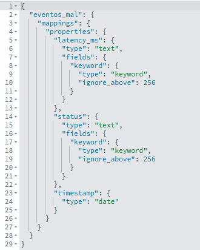

# Opensearch avanzado
## Bloque 1 — Aclaración conceptual forte en Query DSL

Nesta parte non se introducen novas funcionalidades, senón que se clarifican conceptos clave para entender **por que se escribe unha consulta dunha determinada maneira**.

O obxectivo é que o alumnado non memorice sintaxe, senón que entenda o modelo interno de OpenSearch.

---

### 1️⃣ text vs keyword

#### Que é un campo `text`?

- Está pensado para **busca full-text**
- O contido é **analizado** (tokenización, minúsculas, etc.)
- Permite buscar palabras dentro dun texto
- Non é adecuado para agregacións directas

Exemplo típico:
- `mensaxe`
- descricións longas
- comentarios

Consulta habitual: `match` sobre campo `text`.

---

#### Que é un campo `keyword`?

- Non se analiza
- O valor almacénase como unha cadea exacta
- Úsase para:
  - filtros exactos
  - agrupacións
  - ordenación

Exemplo típico:
- `nivel` (info, warn, error)
- `servizo`
- `usuario`
- `endpoint`

Consulta habitual: `term` sobre campo `keyword`.

#### Idea clave

> O tipo de dato determina como se pode consultar o campo.

En contornas de logs e Big Data:
- Campos categóricos → `keyword`
- Texto libre → `text`

Se se modela mal o campo, as consultas posteriores serán incorrectas ou ineficientes.

---

### 2️⃣ match vs term

#### `match`

- Analiza o texto
- Pensado para campos `text`
- Busca coincidencias por palabras

Exemplo conceptual:
- Buscar mensaxes que conteñan "timeout"

Non busca exactitude literal, senón coincidencia textual.

---

#### `term`

- Busca coincidencia exacta
- Non analiza o valor
- Ideal para campos `keyword`

Exemplo conceptual:
- `nivel = error`
- `servizo = db`

---

#### Erro típico

Usar `match` en campos categóricos como `nivel`.

Pode funcionar, pero:
- É innecesario
- Pode afectar ao scoring
- Non é a práctica correcta

En logs:

> Campos categóricos → `term`  
> Texto libre → `match`

---

### 3️⃣ must vs filter

Ambos aparecen dentro dunha consulta `bool`, pero non fan exactamente o mesmo.

#### `must`

- A condición é obrigatoria
- Contribúe ao cálculo de `_score`
- Pensado para relevancia en buscadores

---

#### `filter`

- A condición é obrigatoria
- NON contribúe ao `_score`
- É máis eficiente
- Úsase para filtros exactos

---

#### En que contexto estamos?

En buscadores tipo Google:
- Importa o ranking
- Importa o `_score`
- `must` ten sentido

En logs e observabilidade:
- Non buscamos relevancia
- Buscamos condicións exactas
- Non importa a orde por score

Conclusión práctica:

> En logs, normalmente úsase `filter`, non `must`.

---

### 4️⃣ Que é `_score` e por que non importa en logs?

`_score` é unha métrica de relevancia:

- Indica canto de ben coincide un documento coa consulta
- Útil en buscadores textuais

Pero en contornas de Big Data e logs:

- Non se está a facer ranking por relevancia
- Estase filtrando por condicións
- Normalmente ordénase por tempo (`timestamp`)

Por iso:

> En análise de logs, `_score` case nunca é relevante.

---

## Resumindo
- O mapping condiciona como se pode consultar.
- `text` → `match`
- `keyword` → `term`
- `filter` é preferible a `must` en logs.
- `_score` é irrelevante na maioría dos casos de observabilidade.

Este bloque permite pasar de “saber escribir consultas” a “entender o modelo de busca e análise”.

## Bloque 2 — Modelado e erros reais en OpenSearch

Neste bloque o foco xa non está na sintaxe da consulta, senón no **modelado dos datos**.

En Big Data, a forma en que se define o esquema (mapping) condiciona totalmente:
- as consultas posibles
- o rendemento
- as agregacións
- a calidade da análise

---

### 1️⃣ Que pasa se non definimos mapping?

Se se crea un índice sen especificar `mappings`, OpenSearch activa a **inferencia automática de tipos**.

Exemplo conceptual:
```http
PUT eventos_mal
```
Aquí non se define ningún `mappings`.
O seguinte paso sería indexar u ndocumento (en `Dev Tools` -> `Console`).
```http
POST eventos_mal/_doc
{
  "timestamp": "2026-02-10T10:00:00",
  "status": "500",
  "latency_ms": "300"
}
```
Observación importante:
> `status` e `latency_ms` están enviados como *string*, non como número, xa que levan comiñas.

O seguinte paso sería consultar o `mapping` xerado automáticamente:
```http
GET eventos_mal/_mapping
```
Aquí pode verse que *OpenSearch* decidiu automaticamente o tipo de cada campo.


#### Que implica isto?
Se `status` chega como texto `"500"`:

- OpenSearch pode inferilo como `text`
- Non será un campo numérico
- Non se poderá facer correctamente un `range`
- As agregacións poden non funcionar como se espera

---

### 2️⃣ A inferencia automática non é neutra

OpenSearch decide o tipo segundo:
- o primeiro valor recibido
- o formato detectado

Isto implica:

> O primeiro documento condiciona todo o índice.

Nun contorno real con moitos produtores:
- Un produtor pode enviar `"200"` (string)
- Outro pode enviar `200` (integer)
- O índice quedará definido segundo o primeiro

E o erro pode non detectarse ata semanas despois.

---

### 3️⃣ Problema típico: número almacenado como texto

Se `status` está como `text`:

- Non se poden facer rangos correctamente
- As agregacións numéricas non funcionan
- As comparacións poden ser lexicográficas, non numéricas

Exemplo conceptual:

Comparación lexicográfica:
- "1000" < "200"  (porque compara carácter a carácter)

Comparación numérica:
- 1000 > 200

Este tipo de erro é moi grave en análise de datos.

---


### 4️⃣ Como se evita?

Definindo explicitamente o mapping:

- `status` → `integer`
- `latency_ms` → `integer`
- `timestamp` → `date`
- `nivel`, `servizo` → `keyword`
- `mensaxe` → `text`

Isto garante:

- Coherencia
- Posibilidade de agregación
- Consultas correctas
- Rendemento estable

---

### 5️⃣ Por que en contornos reais se usan templates?

En produción non se crean índices manualmente un por un.

Utilízanse:

- **Index templates**
- Configuración previa de mappings
- Estruturas estandarizadas

Porque:

- Evita erros humanos
- Impide inferencias incorrectas
- Permite manter consistencia entre índices
- Facilita escalabilidade

---

### 6️⃣ Enfoque Big Data

En sistemas grandes:

- O custo de modelar mal é moi alto
- Cambiar o mapping require reindexación
- Reindexar pode implicar millóns ou billóns de documentos

Por iso:

> O modelado correcto é unha decisión arquitectónica, non unha cuestión técnica menor.

---

## Resumindo:

- A inferencia automática é cómoda, pero perigosa.
- O primeiro documento define o tipo.
- Números como texto xeran erros analíticos graves.
- O mapping debe definirse conscientemente.
- En produción utilízanse templates para garantir consistencia.

---

# Bloque 3 — Laboratorio avanzado: análise real de logs

Neste bloque xa non se trata de practicar sintaxe illada, senón de facer **análise de datos real** combinando:

- filtros
- agregacións
- métricas
- agrupación temporal

É a ponte natural cara á unidade de dashboards.

---

## Exercicio 1 — Latencia media por servizo

### Obxectivo

Calcular a latencia media (`latency_ms`) agrupada por `servizo`.

### Que conceptos se aplican

- `terms`
- `avg`
- agregacións anidadas
- `size: 0` cando non queremos documentos

### Consulta

```http
GET eventos/_search
{
  "size": 0,
  "aggs": {
    "por_servizo": {
      "terms": {
        "field": "servizo"
      },
      "aggs": {
        "latencia_media": {
          "avg": {
            "field": "latency_ms"
          }
        }
      }
    }
  }
}

  ```
> Isto permite interpretar que servizo ten maior latencia e observar se hai diferencias significativas entre servizos.

## Exercicio 2 — Número de erros por hora
### Obxectivo

Contar cantos eventos con `nivel = error` se producen por hora.

### Que conceptos se aplican

- `term` en `query`.
- `date_histogram`.
- agrupación temporal.

### Consulta

```http
GET eventos/_search
{
  "size": 0,
  "query": {
    "term": {
      "nivel": "error"
    }
  },
  "aggs": {
    "erros_por_hora": {
      "date_histogram": {
        "field": "timestamp",
        "calendar_interval": "hour"
      }
    }
  }
}

  ```
> Isto permite identificar horas con máis concentración de erros e posibles patróns temporais.

## Exercicio 3 — Filtro temporal + agregación
### Obxectivo

Analizar só as últimas 24 horas.

### Que conceptos se aplican

- `range` sobre `timestamp`.
- Combinación con agregacións

### Consulta

```http
GET eventos/_search
{
  "size": 0,
  "query": {
    "term": {
      "nivel": "error"
    }
  },
  "aggs": {
    "erros_por_hora": {
      "date_histogram": {
        "field": "timestamp",
        "calendar_interval": "hour"
      }
    }
  }
}

  ```
> Isto permite identificar horas con máis concentración de erros e posibles patróns temporais.

## Exercicio proposto
### Enunciado

Identificar o servizo máis problemático nas últimas 24 horas considerando:

- número total de eventos
- número de erros
- latencia media

---

### Orientación 
Deberase:

1. Filtrar por rango temporal (últimas 24h)
2. Agrupar por `servizo`
3. Calcular:
   - `value_count`
   - `avg` de `latency_ms`
4. Engadir unha agregación filtrada para contar só erros