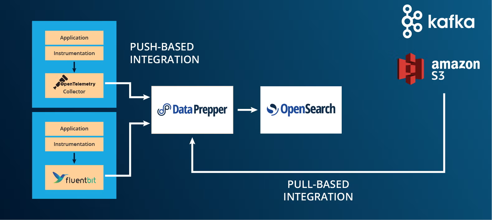
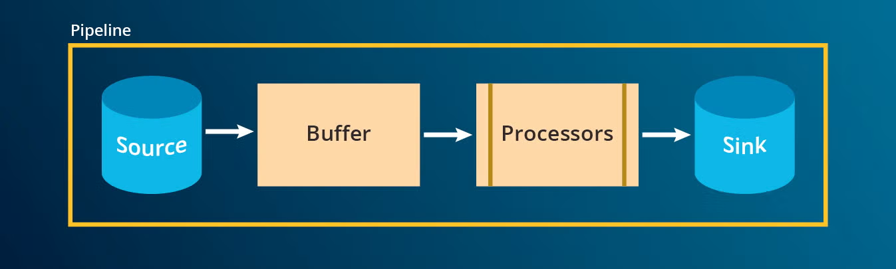

# Data Prepper – Apuntamentos ampliados

## 1. Introdución

Data Prepper é unha ferramenta de inxestión e procesamento de datos do ecosistema OpenSearch.

A súa función principal é actuar como capa intermedia entre:

- sistemas que xeran datos (APIs, aplicacións, logs, dispositivos IoT, brokers…)
- e o sistema de almacenamento e consulta (OpenSearch)

Permite:

- recibir eventos
- transformalos
- enriquecelos
- filtralos
- redirixilos
- e indexalos

Arquitecturalmente sitúase entre produtores e OpenSearch:

```
Producers → Data Prepper → OpenSearch → Dashboards
```

É conceptualmente comparable a:

- Logstash (ecosistema Elastic)
- Fluentd
- Kafka Connect (nalgúns escenarios)
- Unha capa de inxestión previa a Spark ou a un Data Lake


---

## 2. Arquitectura interna

Un pipeline de Data Prepper segue este modelo:



### 2.1 Source  

Recibe os datos desde unha fonte externa.

Exemplos de *sources* en Data Prepper:

- `http`: recibe eventos mediante peticións HTTP (normalmente en formato JSON).
- `kafka`: consume mensaxes desde un ou varios topics de Apache Kafka.
- `otel_trace_source`: recibe trazas distribuídas (traces) no formato OpenTelemetry (OTLP), usadas en observabilidade de microservizos.
- `otel_logs_source`: recibe logs estruturados enviados mediante o protocolo OpenTelemetry.
- `otel_metrics_source`: recibe métricas (CPU, memoria, latencia, etc.) exportadas mediante OpenTelemetry.
- `file`: le eventos desde ficheiros locais (modo batch ou seguimento de logs).
- `s3`: importa datos almacenados en buckets S3 ou compatibles (por exemplo, MinIO).
- `opensearch`: le datos desde índices existentes en OpenSearch.
- `pipeline`: recibe eventos doutro pipeline interno dentro de Data Prepper.

### 2.2 Buffer  

Cola intermedia que desacopla a inxestión do procesamento, permitindo absorber picos de carga e mellorar a tolerancia a fallos.

Exemplos de *buffers* en Data Prepper:

- `bounded_blocking`: buffer en memoria con tamaño máximo definido; cando se enche, bloquea a inxestión ata liberar espazo.
- `bounded_blocking` con `batch_size` e `buffer_size`: permite controlar o número de eventos almacenados e enviados por lote.
- `kafka`: utiliza Apache Kafka como buffer externo, proporcionando persistencia e maior escalabilidade.

### 2.3 Processors  

Transforman, filtran ou enriquecen os eventos antes de seren enviados ao *sink*.

Exemplos de *processors* en Data Prepper:

- `grok`: extrae campos estruturados a partir de texto non estruturado (por exemplo, liñas de log).
- `date`: converte e normaliza campos de data a un formato estándar.
- `add_entries`: engade novos campos aos eventos.
- `delete_entries`: elimina campos específicos dun evento.
- `rename_keys`: renomea campos existentes.
- `route`: redirixe eventos segundo condicións definidas.
- `drop_events`: descarta eventos que cumpren determinadas condicións.
- `aggregate`: agrupa eventos e realiza operacións de agregación.
- `geoip`: enriquece eventos con información xeográfica a partir dun enderezo IP.
- `service_map`: constrúe relacións entre servizos a partir de trazas OpenTelemetry.

### 2.4 Sink  

Destino final dos datos, onde se almacenan ou expoñen para a súa consulta (habitualmente OpenSearch).

Exemplos de *sinks* en Data Prepper:

- `opensearch`: envía os eventos a un índice de OpenSearch para busca e visualización.
- `stdout`: imprime os eventos pola saída estándar (útil para probas e depuración).
- `file`: escribe os eventos nun ficheiro local.
- `s3`: almacena os eventos nun bucket S3 ou compatible.
- `kafka`: publica os eventos nun topic de Apache Kafka.
- `pipeline`: envía os eventos a outro pipeline interno dentro de Data Prepper.

---

## 3. Estrutura da configuración

Data Prepper configúrase mediante dous tipos de ficheiros.

### 3.1 Configuración global

Ficheiro:

```
data-prepper-config.yaml
```

Exemplo:

```yaml
ssl: false
serverPort: 4900

authentication:
  unauthenticated: {}
```

Permite configurar:

- SSL/TLS
- porto admin
- autenticación
- configuración xeral do runtime

---

### 3.2 Configuración de pipelines

Localízanse no cartafol:

```
pipelines/
```

Cada ficheiro YAML pode conter un ou varios pipelines.

---

## 4. Sintaxe dun pipeline

Estrutura xeral:

```yaml
nome-do-pipeline:
  source:
    tipo_source:
      opcións...

  processor:
    - tipo_processor:
        opcións...
    - outro_processor:
        opcións...

  sink:
    - tipo_sink:
        opcións...
```

Puntos importantes:

- A indentación é obrigatoria (espazos, non tabulacións).
- `processor` e `sink` son listas.
- Pode haber múltiples processors e múltiples sinks.
- Un pipeline pode non ter processors.

---

## 5. Sources (Fontes de datos)

### 5.1 HTTP Source

Permite recibir eventos mediante HTTP POST.

```yaml
logs-pipeline:
  source:
    http:
      path: "/events"
      port: 2021
```

Características:

- Espera JSON no corpo da petición.
- Normalmente recibe unha lista de eventos:

```json
[
  {
    "timestamp": "2026-02-23T10:00:00Z",
    "campo": "valor"
  }
]
```

Uso típico:

- Producers en Python
- Webhooks
- Integracións sinxelas

---

### 5.2 Kafka Source

Permite consumir mensaxes dun tópico Kafka. 

```yaml
kafka-pipeline:
  source:
    kafka:
      bootstrap_servers:
        - "kafka:9092"
      topics:
        - "logs-topic"
      group_id: "dataprepper-group"
```

Uso típico:

- Arquitecturas con broker intermedio
- Procesamento de streaming empresarial

> Kafka actúa como capa intermedia de streaming e desacoplamento entre produtores e consumidores.

---

### 5.3 OpenTelemetry Source

Empregado en observabilidade para recibir datos no estándar OpenTelemetry (OTLP).

Permite recoller:
- trazas distribuídas (traces)
- logs estruturados
- métricas

É habitual en arquitecturas de microservizos, Kubernetes ou aplicacións instrumentadas.

Exemplo:

```yaml
otel-pipeline:
  source:
    otel_trace_source:
      ssl: false
      port: 21890
```

Uso:

- Recollida de traces
- Integración con aplicacións instrumentadas

---

### 5.4 S3 Source

Permite inxerir datos almacenados en Amazon S3 ou sistemas compatibles (por exemplo, MinIO).

Está orientado a procesamento batch e integración con arquitecturas tipo Data Lake.

Resulta útil cando:
- se reciben ficheiros periódicos
- se traballa con datos históricos
- se constrúe unha pipeline ETL

Exemplo:

```yaml
s3-pipeline:
  source:
    s3:
      bucket:
        - "my-bucket"
      aws:
        region: "eu-west-1"
```

Uso:

- Procesamento batch
- ETL

---

## 6. Processors (Transformación de datos)

Permiten modificar os eventos antes de envialos ao destino.

---

### 6.1 rename_keys

Renomea campos.

```yaml
processor:
  - rename_keys:
      entries:
        - from_key: "latency_ms"
          to_key: "latency"
```

---

### 6.2 delete_entries

Elimina campos.

```yaml
processor:
  - delete_entries:
      with_keys:
        - "extra"
```

---

### 6.3 add_entries

Engade novos campos.

```yaml
processor:
  - add_entries:
      entries:
        - key: "entorno"
          value: "laboratorio"
```

---

### 6.4 grok

Extrae campos dun texto non estruturado.

```yaml
processor:
  - grok:
      match:
        message: "%{IP:client} %{WORD:method} %{URIPATHPARAM:request}"
```

Uso típico:

- Procesamento de logs en formato texto

---

### 6.5 route

Permite enrutado condicional.

```yaml
processor:
  - route:
      routes:
        - error_route: '/nivel == "error"'
```

---

## 7. Sinks (Destinos)

### 7.1 OpenSearch Sink

O destino máis habitual.

```yaml
sink:
  - opensearch:
      hosts: ["https://opensearch:9200"]
      insecure: true
      username: "admin"
      password: "Opensearch#2025"
      index: "logs_http"
```

Parámetros relevantes:

- hosts
- index
- credenciais
- configuración SSL

---

### 7.2 stdout

Útil para debugging.

```yaml
sink:
  - stdout:
```

Permite visualizar eventos por consola.

---

### 7.3 Múltiples sinks

```yaml
sink:
  - opensearch:
      index: "logs_http"
  - stdout:
```

---

## 8. Exemplo completo avanzado

```yaml
bikes-pipeline:
  source:
    http:
      path: "/events"
      port: 2022

  processor:
    - delete_entries:
        with_keys:
          - "extra"
    - add_entries:
        entries:
          - key: "tipo"
            value: "bike_event"

  sink:
    - opensearch:
        hosts: ["https://opensearch:9200"]
        insecure: true
        username: "admin"
        password: "Opensearch#2025"
        index: "citybikes_http"
```

---

## 9. Erros típicos

### 9.1 Ficheiro YAML baleiro

Erro:

```
No content to map due to end-of-input
```

### 9.2 Dous HTTP source no mesmo porto

Provoca caída de Data Prepper.

### 9.3 JSON mal formado

Erro de deserialización.

### 9.4 Mala indentación YAML

Produce ParseException.

---

## 10. Boas prácticas

- Separar pipelines segundo responsabilidade.
- Usar índices distintos para tipos de datos distintos.
- Empregar timestamp en formato ISO 8601 UTC.
- Non reutilizar o mesmo porto en dous HTTP source.
- Probar primeiro con sink stdout.
- Documentar claramente cada pipeline.

---

## 11. Posición dentro dunha arquitectura Big Data

Data Prepper non é:

- un motor distribuído tipo Spark
- un broker tipo Kafka
- unha base de datos

É:

- unha ferramenta de inxestión e transformación lixeira
- unha capa de entrada para OpenSearch
- un compoñente habitual en arquitecturas de observabilidade
- unha alternativa simple para pipelines ETL pequenos

---

## 12. Relación con Spark e streaming

En comparación con Spark Structured Streaming:

- Data Prepper é máis lixeiro.
- Spark permite procesamento distribuído complexo.
- Data Prepper está máis orientado a inxestión e transformación básica.
- Spark está orientado a análise e transformación masiva.

---

## 13. Comparativa: Data Prepper vs Logstash

**Semellanzas**
- Ambos implementan pipelines do tipo: input/source → filter/processor → output/sink.
- Permiten transformar, filtrar e enriquecer eventos.
- Úsanse en arquitecturas de inxestión de logs e datos.

**Diferenzas principais**

- **Ecosistema**
  - Logstash → Elastic Stack (Elasticsearch).
  - Data Prepper → OpenSearch.

- **Enfoque**
  - Logstash → ETL de logs e eventos xeralista.
  - Data Prepper → orientado a observabilidade e OpenTelemetry.

- **OpenTelemetry**
  - Logstash → require configuración ou plugins adicionais.
  - Data Prepper → soporte nativo para traces, logs e métricas OTEL.

- **Plugins**
  - Logstash → ecosistema moi amplo e maduro.
  - Data Prepper → menor variedade, pero máis enfocado.

**Resumo**

- Logstash é unha solución madura e moi flexible para procesamento de datos.
- Data Prepper é unha alternativa moderna centrada en OpenSearch e observabilidade cloud-native.

---

## 14. Resumo

Data Prepper permite definir pipelines declarativos en YAML que especifican:

- de onde veñen os datos (source)
- como se transforman (processors)
- a onde van (sink)

É unha ferramenta clave cando se quere construír unha arquitectura:

```
Inxestión → Transformación → Indexación → Visualización
```
---

## 15. Bibliografía

- OpenSearch Project. *Data Prepper Documentation*.  
  https://opensearch.org/docs/latest/data-prepper/

- OpenSearch Project. *OpenSearch Documentation*.  
  https://opensearch.org/docs/

- OpenTelemetry Project. *OpenTelemetry Documentation*.  
  https://opentelemetry.io/docs/

- Elastic. *Logstash Documentation*.  
  https://www.elastic.co/guide/en/logstash/current/index.html

- Kreps, J., Narkhede, N., Rao, J. (2011). *Kafka: A Distributed Messaging System for Log Processing*. LinkedIn Engineering.

- Zaharia, M. et al. (2016). *Apache Spark: A Unified Engine for Big Data Processing*. Communications of the ACM.