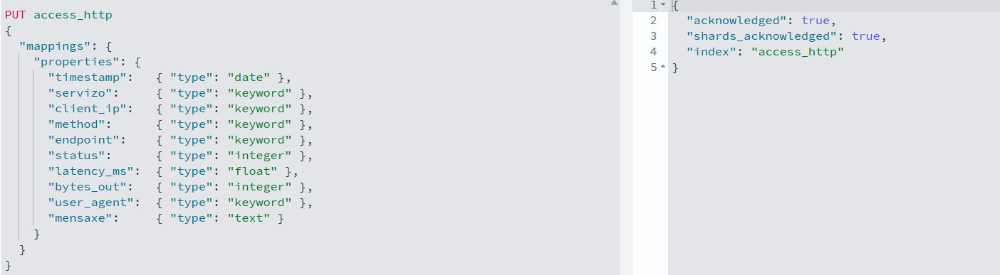
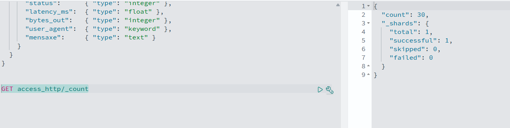
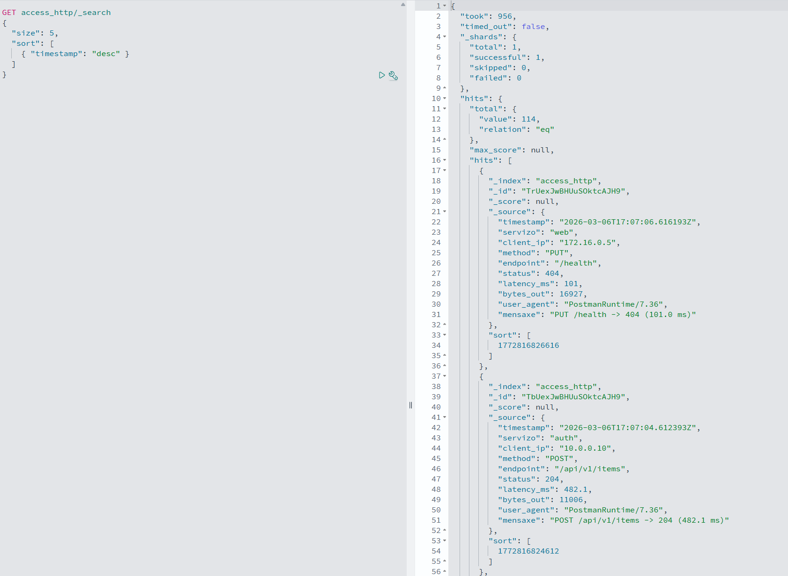
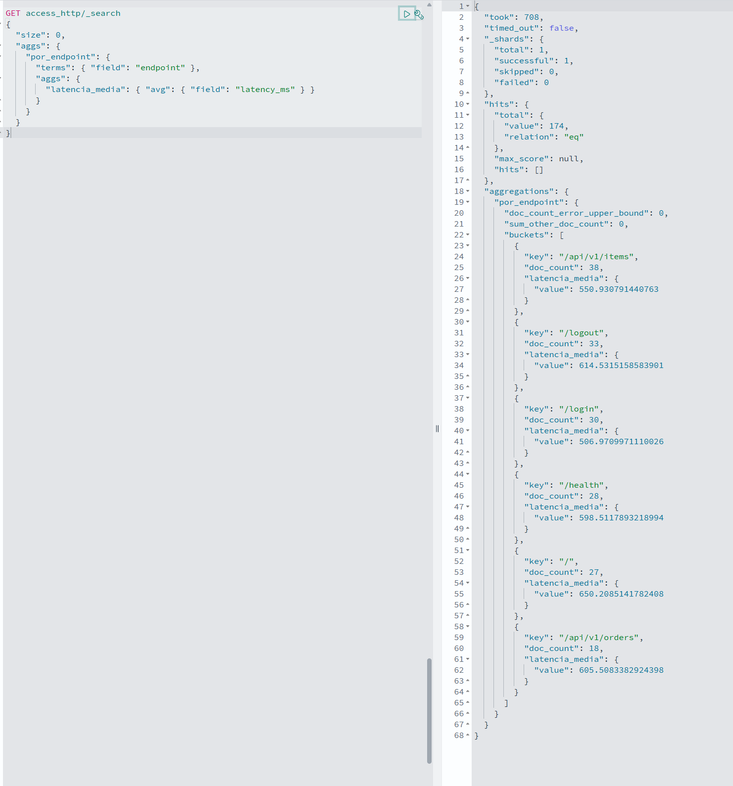

# Tarefa dataprepper (SOLUCIÓN)

## Pipeline
```yaml
access-http-pipeline:
  source:
    http:
      path: "/events/access"
      port: 2023

  sink:
    - opensearch:
        hosts: ["https://opensearch:9200"]
        username: "admin"
        password: "Opensearch#2025"
        index: "access_http"
        insecure: true
```

## Produtor
```python
import time
import random
import requests
from datetime import datetime, timezone

DATAPREPPER_URL = "http://data-prepper:2023/events/access"
POLL_SECONDS = 2
TIMEOUT = 5

SERVICES = ["web", "api", "auth"]
METHODS = ["GET", "POST", "PUT", "DELETE"]
ENDPOINTS = ["/", "/login", "/logout", "/api/v1/items", "/api/v1/orders", "/health"]
STATUS_CODES = [200, 201, 204, 400, 401, 403, 404, 500, 502, 503]
USER_AGENTS = [
    "Mozilla/5.0",
    "curl/8.0",
    "PostmanRuntime/7.36",
    "Python-requests/2.31",
]
IPS = ["10.0.0.10", "10.0.0.11", "10.0.0.12", "192.168.1.20", "172.16.0.5"]


def now_utc_iso():
    return datetime.now(timezone.utc).isoformat().replace("+00:00", "Z")


print(f"[access] enviando a {DATAPREPPER_URL}")

while True:
    servizo = random.choice(SERVICES)
    method = random.choice(METHODS)
    endpoint = random.choice(ENDPOINTS)
    status = random.choice(STATUS_CODES)

    latency_ms = round(random.uniform(5, 1200), 2)
    bytes_out = random.randint(200, 20000)

    evento = {
        "timestamp": now_utc_iso(),
        "servizo": servizo,
        "client_ip": random.choice(IPS),
        "method": method,
        "endpoint": endpoint,
        "status": status,
        "latency_ms": latency_ms,
        "bytes_out": bytes_out,
        "user_agent": random.choice(USER_AGENTS),
        "mensaxe": f"{method} {endpoint} -> {status} ({latency_ms} ms)"
    }

    try:
        r = requests.post(DATAPREPPER_URL, json=[evento], timeout=TIMEOUT)
        print("status:", r.status_code, "| enviado:", evento["mensaxe"])
    except Exception as e:
        print("[access] erro:", repr(e))

    time.sleep(POLL_SECONDS)
```
## 1. Saída de `GET access_http/_mapping`


## 2. Saída de `GET access_http/_count`


## 3. Unha consulta `_search` con resultados


## 4. Agregación da latencia media
